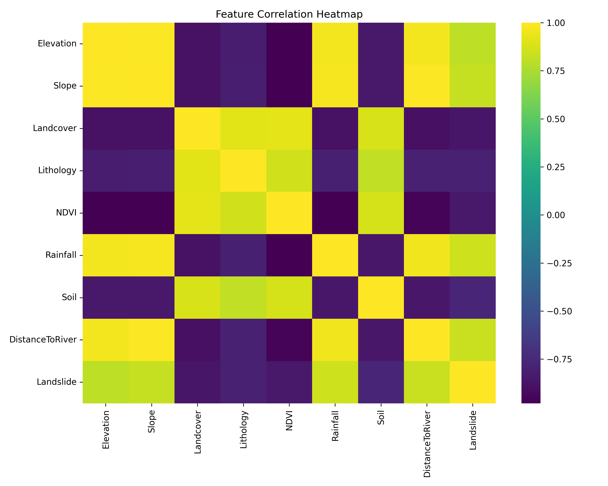
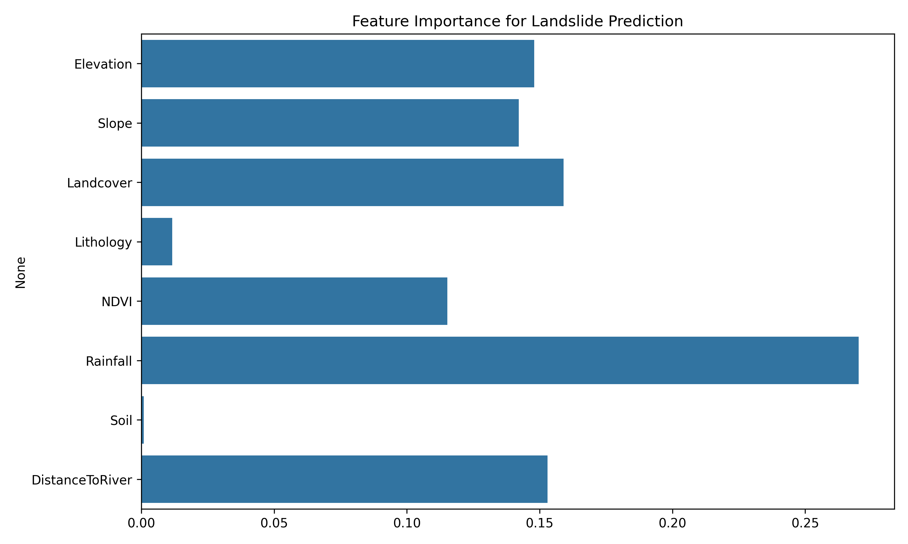

<h1 align="center">🌍 Terrain Hazard Prediction Using Machine Learning</h1>

  <em>A DGRE-oriented geospatial ML project for landslide susceptibility analysis using terrain and environmental factors.</em>

<h2>🚀 Project Overview</h2>

This project predicts landslide susceptibility using environmental and terrain parameters such as elevation, slope, lithology, NDVI, rainfall, soil type, and proximity to rivers.  
A <strong>RandomForest classifier</strong> is trained on a structured hazard dataset and visualized using correlation heatmaps and feature importance graphs.

<h2>📁 Project Structure</h2>

<pre>
terrain-hazard-prediction/
│
├── src/
│   └── terrain_hazard_predictor.py
│
├── figures/
│   ├── heatmap.png
│   └── feature_importance.png
│
├── reports/
│   ├── Terrain_Hazard_Report.pdf
│   └── Terrain_Hazard_Abstract.pdf
│
├── landslide_data.csv
├── requirements.txt
└── README.md
</pre>

<h2>📊 Model Performance</h2>

The RandomForest model achieved the following performance on the test split:

<pre>
Accuracy        : 100%
Precision (0/1): 100%
Recall (0/1)   : 100%
F1 Score       : 100%
</pre>

Confusion Matrix:

<pre>
[[7 0]
 [0 7]]
</pre>

<h2>📈 Visualizations</h2>

<h3>🔶 Correlation Heatmap</h3>

  

<h3>🔷 Feature Importance Plot</h3>

  

<h2>🧠 Machine Learning Workflow</h2>
<ol>
  <li>Load terrain hazard dataset</li>
  <li>Split into training & testing sets</li>
  <li>Train RandomForest Classifier</li>
  <li>Evaluate performance using standard metrics</li>
  <li>Generate correlation heatmap & feature importance</li>
</ol>

<h2>🔧 Technologies Used</h2>
<ul>
  <li>Python 3.10+</li>
  <li>Pandas</li>
  <li>NumPy</li>
  <li>Scikit-Learn</li>
  <li>Matplotlib</li>
  <li>Seaborn</li>
</ul>

<h2>✨ Author</h2>

  <strong>Shaik Zaheer Abbas</strong> 
  AI & Mathematical Sciences Student | Researcher 
  Geethanjali College of Engineering and Technology, Hyderabad

